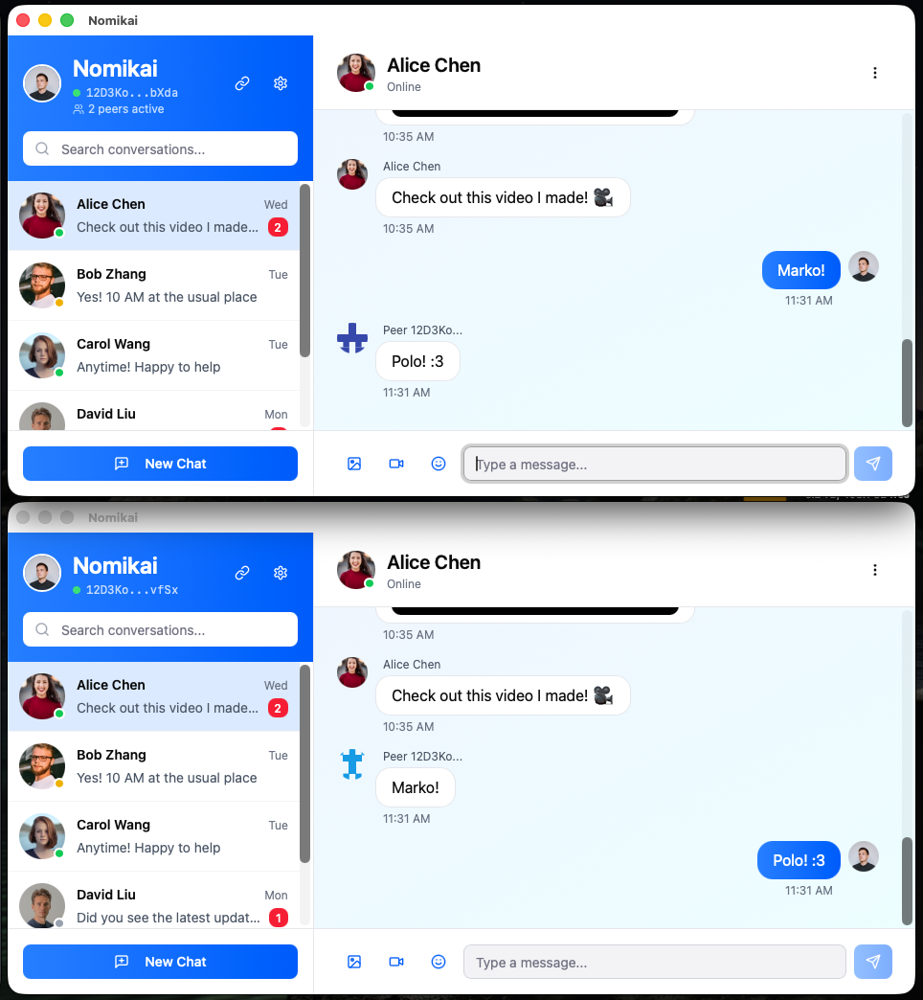

# Nomikai 飲み会 ("drinking party") 

Nomikai is a decentralized chat app that intends to run on P2P technology safely for the masses.
This is more or less just a barely functional proof of concept, with lots of example bits that
haven't been implemented at all yet. 

## Demo

## Running the code
Nomikai is a Vite application, and run's on the desktop using Tauri. Plans are in the works for mobile targets
like iOS and Android (via Capacitor etc).

Run `npm i` to install the dependencies.

Run `npm run dev` to start the development server.
  
